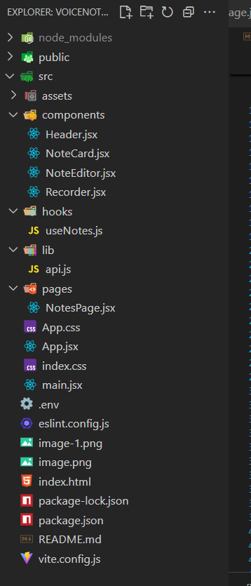

# Voice Notes GenAI Frontend

This is the **frontend application** for the Voice Notes GenAI project. It provides a clean, minimal UI to record, upload, manage, edit, and summarize voice notes. Built with **React + Tailwind CSS**, it integrates seamlessly with the backend API to deliver a smooth user experience.

## 🚀 Features

* 🎙️ **Record Notes** directly from your browser microphone.
* 📤 **Upload Audio Files** and convert them into text notes.
* 📝 **Edit Notes** with an in-app editor.
* 🗑️ **Delete Notes** with confirmation.
* ✨ **AI Summarization** to generate concise summaries of your notes.
* 🎨 **Responsive UI** optimized for desktop and mobile.


## 🛠️ Tech Stack

* **React** (functional components + hooks)
* **Tailwind CSS** (utility-first styling)

## 📂 Project Structure



## ⚡ Getting Started

1. **Clone the repository**

   ```bash
   git clone https://github.com/DEVnitishOfficial/VoiceNotes_GenAI_Frontend.git
   cd VoiceNotes_GenAI_Frontend
   ```

2. **Install dependencies**

   ```bash
   npm install
   ```

3. **Run the development server**

   ```bash
   npm run dev
   ```

4. **Open the app**
   Visit [http://localhost:5173](http://localhost:5173) (Vite default) in your browser.

## 🔗 Backend Integration

This frontend connects to the **VoiceNotes GenAI Backend** for audio transcription, note management, and AI summarization. Make sure the backend is running and the API base URL is properly configured in your environment variables.

Example:

```
VITE_API_URL=http://localhost:5000/api
```

## 📸 UI Preview

* Upload or record audio from the **Header** section.
* Manage notes with interactive **NoteCards** (edit, delete, summarize).
* **NoteEditor Modal** allows editing and updating note content.
